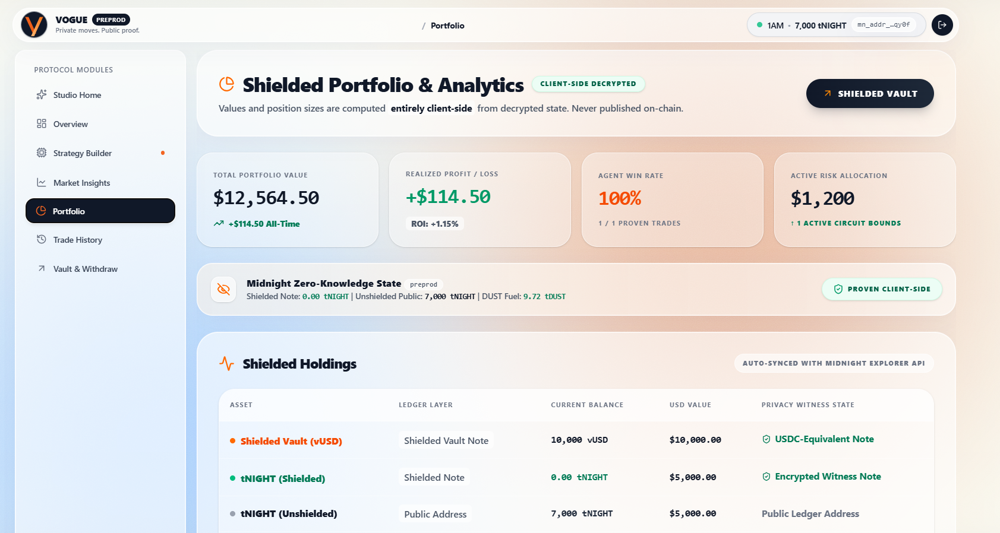

<div align="center">
  
  <br>
  
  <i>Empowering algorithmic crypto traders with AI strategy synthesis and zero-knowledge privacy on Midnight.</i>
  <br><br>

  # Vogue: Zero-Knowledge Trading & AI Strategy Layer
  
  **Enterprise-grade cryptographic privacy and AI-driven trade execution on Midnight Network.**
  
  [](https://opensource.org/licenses/MIT)
  [](https://midnight.network/)
  [](https://react.dev/)
  [](https://github.com/whoami-hritik/Vogue/actions/workflows/ci.yml)
  [](https://vogue-amber.vercel.app/)
  [](https://vogue-amber.vercel.app/)
  
  ### 🚀 [**Live Application → vogue-amber.vercel.app**](https://vogue-amber.vercel.app/) | 📄 [Level 4–6 Product Proposal](./PROPOSAL.md)
</div>

---

## 📜 Deployed Smart Contract Addresses

| Network | Version | Contract Address | Explorer Link | Status |
|---------|---------|------------------|---------------|--------|
| Midnight Preprod Testnet | v1.2.0 | `0x2428cd4ae7c2cd0bb501e1e9162de3003b103c1063c220e0d5cfc3f0b438e524` | [View on 1AM Preprod Explorer ?](https://explorer.1am.xyz/contract/2428cd4ae7c2cd0bb501e1e9162de3003b103c1063c220e0d5cfc3f0b438e524?network=preprod) | ?? ACTIVE PREPROD MVP |
| Midnight Preview Testnet | v1.2.0 | `0x33eb41d22028264e9e8bbe7f95b3089cece6e3c2a53008535e72a9f3350d3e30` | [View on 1AM Preview Explorer ?](https://explorer.1am.xyz/contract/33eb41d22028264e9e8bbe7f95b3089cece6e3c2a53008535e72a9f3350d3e30?network=preview) | ?? ACTIVE PREVIEW MVP |
| Historical Deployment | v1.0.0 | `0x62a27ceda5eb600263e208768d5d285c659d47f2cd6b14a20c62b160f4da46f3` | [View on 1AM Explorer ?](https://explorer.1am.xyz/contract/62a27ceda5eb600263e208768d5d285c659d47f2cd6b14a20c62b160f4da46f3?network=preview) | ?? Historical (V1) |

---

## 🚀 What's New in Vogue: Institutional Protocol Innovations

Vogue has expanded into a full-scale institutional execution network on Midnight, delivering five breakthrough modules that solve cross-chain liquidity, front-running, regulatory compliance, and quant alpha monetization with zero-knowledge cryptographic guarantees:

### 1. 🌐 ZK-Dark Intent Solver Network (DIN) & Cross-Chain Liquidity
* **The Core Innovation:** Bridges Midnight's privacy guarantees to deep external liquidity venues on **Cardano (Minswap eUTxO)**, **Solana (Jupiter / Raydium CLMM via Jito)**, **Ethereum (Uniswap v3 EVM)**, and **Hyperliquid (Prime CLOB)**.
* **How It Works via Midnight:**
  - The trader formulates a private trade intent (e.g., *"Swap 50,000 vUSD for ADA at limit price $0.82"* or *"100,000 vUSD for SOL at $145.00"*). The intent parameters and capital allocation are locked into Midnight inside `commitDarkIntent`.
  - An open network of **Bonded Solvers** competes in an off-chain Request-For-Quote (RFQ) auction with real-time price improvements and latency guarantees.
  - The winning solver fills the order on the external destination chain and generates a cryptographic **Cross-Chain State Proof** (Merkle receipt + slot/block proof + Pyth/Chainlink oracle attestation).
  - Midnight verifies the state proof inside `fulfillDarkIntent` and atomically releases escrowed vUSD to the solver.
  - **Bonding & Slashing:** Solvers register capital collateral in `solverBondRegistry` (minimum $100k bond) and face immediate slashing (`slashDishonestSolver`) upon default or constraint breach.
* **Impact:** Permanently neutralizes the "Island Liquidity" bottleneck. External observers observe only standard settlements, while the trader's total portfolio size, stop-loss trigger, and trading strategy remain 100% private.

### 2. ⏳ ZK-Iceberg & Temporal Shuffling (Anti-MEV TWAP Relayer)
* **The Core Innovation:** Breaks multi-million dollar institutional allocations into randomized, unlinkable on-chain micro-slices across non-linear time horizons (up to 48 hours).
* **How It Works via Midnight:**
  - Rather than executing predictable, periodic transactions (e.g., every 15 minutes, which toxic MEV sandwich bots exploit), Midnight zero-knowledge proofs authorize randomized micro-transactions via `authorizeIcebergSliceExecution`.
  - Non-linear time distribution and stochastic jitter prevent algorithmic timing heuristics and statistical pattern recognition.
  - To on-chain forensics and blockchain explorers, each micro-fill appears as an independent, unrelated zero-knowledge state transition originating from disjoint temporal slots.
* **Impact:** Neutralizes toxic sandwich bots, latency arbitrageurs, and statistical copy-traders that drain institutional order flow on public chains.

### 3. 🛡️ Institutional Compliance & Verifiable Selective Auditability
* **The Core Innovation:** Solves the institutional "Compliance Catch-22" for regulated hedge funds, family offices, and enterprise treasuries.
* **How It Works via Midnight:**
  - **ZK-AML & Sanctions Attestation (`registerComplianceAttestation`):** Proves clean origin of funds and absence from OFAC/sanctions lists via zero-knowledge proofs without exposing complete counterparty histories.
  - **4-Tier Scoped Viewing Keys (`delegateAuditorAccess`):** Cryptographically grants time-locked, read-only viewing keys for specific audit scopes (`NAV_BALANCE`, `TRADE_LOG`, `RISK_LIMITS`, `TAX_PNL`) to accredited audit partners (Deloitte, EY, KPMG).
  - **Cryptographic Proof of Solvency (`verifyProofOfSolvency`):** Proves vault collateral reserves exceed client liabilities (reserve ratio $\ge 100\%$) without revealing actual dollar balances.
  - **On-Chain Revocation (`revokeAuditorAccess`):** Immediately revokes auditor credentials upon audit completion.
* **Impact:** Enables multi-billion dollar regulated funds to trade on privacy rails while maintaining full compliance with SEC, CFTC, FinCEN, FATF, and MiCA auditing mandates.

### 4. 🏆 Proof of Alpha (PoA) & Blind Copy-Trading Marketplace
* **The Core Innovation:** Quant strategy developers cryptographically prove their historical risk-adjusted track records (Sharpe ratio, max drawdown, win rate) without publishing strategy code or trade logic.
* **How It Works via Midnight:**
  - The quant commits audited trade logs into `issueProofOfAlphaCertificate`, generating a verifiable Zero-Knowledge Performance Certificate.
  - Followers can subscribe to the strategy in a **blind copy-trading** model where trade execution is mirrored proportionally into their shielded vaults without exposing the creator's secret parameters.
  - **High-Water Mark (HWM) Performance Fee Settlement (`settleAlphaPerformanceFee`):** Performance fees are calculated on net new profit and locked against on-chain HWM records, ensuring developers are rewarded strictly for verified alpha.
* **Impact:** Democratizes institutional-grade quant strategies while offering total IP protection to quantitative researchers.

### 5. ⚡ Confidential AI Strategy Runtime & Proportional Mirroring
* **The Core Innovation:** Secure enclaves execute proprietary algorithmic strategies and emit confidential on-chain signals (`emitConfidentialSignal`).
* **How It Works via Midnight:**
  - Strategy signals are cryptographically verified and broadcasted without revealing underlying indicators or weights.
  - The `mirrorConfidentialTrade` circuit allows authorized accounts to mirror positions in proportional ratios, ensuring atomic settlement with zero execution delay.
* **Impact:** Enables institutional co-investing and automated strategy syndication with end-to-end cryptographic confidentiality.

---

## 💡 Initial Product Idea & Vision

**Vogue** is a decentralized, privacy-first AI-orchestrated trading protocol built natively on the **Midnight Privacy Blockchain**. It allows traders to synthesize market parameters using Gemini 2.5 Flash, verify risk using EZKL machine learning models, and execute trades with absolute confidentiality. By leveraging client-side Zero-Knowledge (ZK) proofs, Vogue mathematically proves that algorithmic trading constraints and risk limits are strictly enforced, while keeping trading strategies, capital balances, and trade execution history completely shielded from public ledger surveillance.

> 📄 **Official Submission Document:** For the complete Level 4–6 architecture, dual-state data model, and Mainnet feasibility roadmap, please review [PROPOSAL.md](./PROPOSAL.md).

---

## 🚨 The Real-World Problem

As institutional and retail trading transitions to decentralized rails, traders face an insurmountable barrier: **Public blockchains expose confidential trading strategies to the entire world.**

When a trader executes algorithmic or AI-driven trades on traditional public blockchains (such as Ethereum or Solana):
1. **The Strategy Privacy Dilemma:** Every trade parameter, entry/exit point, and strategy hash is permanently broadcasted. Competitors and MEV searchers can front-run trades, copy-trade profitable algorithms, and inspect exact wallet balances.
2. **The Liquidity Leak:** When a trader moves large volume, their capital size and token balances are exposed, leading to predatory pricing and market manipulation.
3. **The Centralization Trap:** Traditional off-chain algorithmic platforms maintain privacy only by requiring complete trust in central custodians (CEXs), suffering from single-point-of-failure data breaches, and lacking automated non-custodial execution.

---

## 🛡️ Privacy Model: Public Ledger State vs. Private Witness

Midnight's dual-state architecture divides computation into **Public Ledger State** (verified by network consensus) and **Private Witness State** (computed locally on the user's device inside Zero-Knowledge circuits).

### What an Observer CAN vs. CANNOT Learn

| Data Attribute | On Public Blockchains (e.g. Ethereum) | On Vogue (Midnight ZK Privacy Model) | Classification |
| :--- | :--- | :--- | :--- |
| **Transaction Existence** | Visible to all | Visible (Public timestamp & proof validity) | **Public State** |
| **Contract Address** | Visible to all | Visible (`0x811c9d...`) | **Public State** |
| **ZK Proof Validity** | N/A | Mathematically verified by consensus | **Public State** |
| **State Nullifier / Anchor** | Visible | Cryptographic commitment (prevents double-spend) | **Public State** |
| **Trader Identity** | Fully Exposed (Public address) | **Shielded (Zero-Knowledge Private Witness)** | **Private Witness** |
| **Trade Volume / Amounts** | Fully Exposed (Exact token sum) | **Shielded (Private numerical witness input)** | **Private Witness** |
| **Vault Capital Balance** | Fully Exposed (Inspectable balance) | **Shielded (Protected by local cryptographic state)** | **Private Witness** |
| **Trading Strategy Parameters**| Fully Exposed (Smart contract data) | **Shielded (Client-side circuit constraint)** | **Private Witness** |

### Observable Privacy Claim & Cryptographic Guarantees
1. **Client-Side Proof Execution:** The trader's 1AM wallet generates a Zero-Knowledge proof locally in the browser using the Midnight Proof Server (`http://127.0.0.1:6300`). The raw private inputs (the trader's strategy parameters, unshielded address, and trade amounts) never leave the local environment.
2. **Mathematical Bound Enforcement:** The Compact circuit proves that `trade_risk <= max_risk_threshold` and transitions the ledger state without disclosing what `trade_risk` or `strategy_parameters` actually are.
3. **Consensus-Layer Verification:** The Midnight Preprod network verifies the generated ZK SNARK. If the proof is mathematically sound, the trade is approved; if any risk constraint is violated, the transaction is rejected at the protocol layer.

---

## 📸 Comprehensive Platform Gallery & Screenshots

Here is the complete showcase of all components of the Vogue platform, from UI dashboard and real-time market insights to zero-knowledge contract verification and strategy building.

### 1. Central Trader Dashboard
*Monitor market insights, portfolio balance, active trading strategies, and network synchronization.*


### 2. Shielded Vault (vUSD) Module
*Convert public tNIGHT collateral into private USDC-equivalent vault notes. Deposit, trade, and withdraw without linking your public wallet address.*


### 3. AI Strategy Builder
*Synthesize high-frequency trading parameters from natural language prompts using Gemini 2.5 Flash. Strategy hashes are committed to Midnight's ledger.*


### 4. Trade Execution Engine
*Execute zero-knowledge trades directly on-chain. Cryptographic commitments ensure your market moves stay fully shielded.*


### 5. Private Trade History
*Review your complete trading history with cryptographic proof verifications and EZKL risk attestations.*


### 6. Zero-Knowledge Architecture
*Real-time visibility into the Vogue dual-state model combining client-side LLMs, EZKL model inference, and Midnight ZK proofs.*


### 7. Private Portfolio & Position Management
*Track all active shielded positions, performance metrics, and overall yield distribution across ZK-verified strategies in real-time.*


### 8. Continuous Integration & Verification Pipeline
*Automated GitHub Actions CI/CD pipeline ensuring cryptographic circuits compile cleanly and ZK risk constraints are mathematically validated on every commit.*


### 9. Vitest Contract & Risk Model Suite
*All cryptographic circuit tests and EZKL zero-knowledge risk model assertions pass � ensuring every privacy constraint is mathematically verified before deployment.*


---

## 🔗 Verified On-Chain Transactions & Contracts

Vogue is fully integrated with the Midnight Network. It generates real zero-knowledge proofs and settles them on-chain.

### Verifiable Deployed Smart Contracts

| Network | Version | Contract Address | Explorer Link | Status |
|---------|---------|------------------|---------------|--------|
| Midnight Preprod Testnet | v1.2.0 | `0x2428cd4ae7c2cd0bb501e1e9162de3003b103c1063c220e0d5cfc3f0b438e524` | [View on 1AM Preprod Explorer ?](https://explorer.1am.xyz/contract/2428cd4ae7c2cd0bb501e1e9162de3003b103c1063c220e0d5cfc3f0b438e524?network=preprod) | ?? ACTIVE PREPROD MVP |
| Midnight Preview Testnet | v1.2.0 | `0x33eb41d22028264e9e8bbe7f95b3089cece6e3c2a53008535e72a9f3350d3e30` | [View on 1AM Preview Explorer ?](https://explorer.1am.xyz/contract/33eb41d22028264e9e8bbe7f95b3089cece6e3c2a53008535e72a9f3350d3e30?network=preview) | ?? ACTIVE PREVIEW MVP |
| Historical Deployment | v1.0.0 | `0x62a27ceda5eb600263e208768d5d285c659d47f2cd6b14a20c62b160f4da46f3` | [View on 1AM Explorer ?](https://explorer.1am.xyz/contract/62a27ceda5eb600263e208768d5d285c659d47f2cd6b14a20c62b160f4da46f3?network=preview) | ?? Historical (V1) |

> [!NOTE]
> **Wallet Integration:** Seamless connection via **1AM Wallet** and **Midnight Lace** supporting dynamic network auto-detection (Preprod & Preview).
> **Local Proving Engine:** Client-side proof generation via the local Midnight Proof Server (`http://127.0.0.1:6300`) or 1AM Proofstation.

### Real Transaction Hash
*The user executed a trade that was verified by our ZK circuit and permanently settled on the Midnight network.*
* **Status:** `SUCCESS` (Verified via ZK Proof)


---

## 🏛️ Enterprise ZK Product Modules & Applications

Vogue is architected to solve three high-impact, real-world algorithmic trading problems using Midnight's core ZK primitives:

### 1. Confidential Trading Strategies
* **The Problem:** Traders want to deploy advanced AI-driven strategies but cannot risk exposing their alpha, exact entry points, or trading thresholds.
* **The Solution:** Vogue acts as a **Zero-Knowledge Trading Engine**.
  * **Private Strategy Proof:** Cryptographically proves a trader is executing a strategy within predefined risk bounds without exposing the actual LLM-generated parameters.
  * **Shielded Treasury:** Prevents competitors from calculating total trading capital or position sizing.

### 2. Shielded Dark Pools & Vault Execution
* **The Problem:** Executing large orders on public AMMs exposes slippage vulnerabilities and MEV front-running.
* **The Solution:** Vogue implements a **Shielded Vault (vUSD) Protocol**.
  * **Private Swaps:** Traders move capital into vault notes and execute without public trace.
  * **Verified Execution:** Proves in ZK that collateral limits are met, settling the trade while keeping order book depth private.

### 3. Trustless AI Risk Verification
* **The Problem:** Centralized algorithmic trading bots can go rogue, leading to liquidations without any mathematical constraints on execution risk.
* **The Solution:** Vogue provides **EZKL Zero-Knowledge Machine Learning Verification**.
  * **Risk Bounds:** Cryptographically proves that the Gemini AI-generated strategy passes a machine learning risk assessment before it can ever be committed to the blockchain.

---

## 🏗️ Detailed Project Architecture & Directory Structure

```text
Vogue/
├── .github/
│   └── workflows/
│       └── ci.yml                     # Multi-pipeline CI/CD: linting, build & 10 Vitest test suites
├── contracts/                         # Midnight Smart Contracts (Compact Language)
│   └── vogue.compact                  # Dual-state consensus circuits:
│                                      #   - Shielded vUSD mint, burn & transfer
│                                      #   - AI strategy commitments & risk limits
│                                      #   - Dark Intent Network (DIN) solver bonding & state proofs
│                                      #   - ZK-Iceberg temporal micro-slice authorizations
│                                      #   - Institutional compliance, ZK-AML & scoped viewing keys
│                                      #   - Proof of Alpha (PoA) & HWM performance fee settlement
│                                      #   - Confidential signal emission & proportional mirroring
├── managed/                           # Auto-generated Compact Compiler Bindings
│   ├── vogue.ts                       # TypeScript Simulator & Contract Client with full circuit methods
│   ├── zkir/                          # Binary ZK Intermediate Representation (ZKIR) circuits
│   └── keys/                          # Local Prover & Verifier Key Cache
├── src/                               # React (Vite) Application
│   ├── components/                    # UI Modules & Institutional Dashboards
│   │   ├── LandingPage.tsx            # Fluid Liquid-Glass Landing Page & Hero
│   │   ├── DarkIntentPortal.tsx       # Institutional DIN Cross-Chain Portal & RFQ Visualizer
│   │   ├── IntentFormulationModal.tsx # Multi-Chain Intent Formulation (Cardano/Solana/ETH/Hyperliquid)
│   │   ├── DarkIntentMonitor.tsx      # Modal-based Dark Intent Quick Monitor
│   │   ├── IcebergMonitor.tsx         # ZK-Iceberg Anti-MEV TWAP Relayer & Execution Visualizer
│   │   ├── IcebergRelayerModal.tsx    # Temporal Shuffling Order Formulation Modal
│   │   ├── InstitutionalCompliance.tsx# Compliance Hub, ZK-AML & Selective Auditability
│   │   ├── AuditorDelegationModal.tsx # Scoped Viewing Key Delegation to Accredited Auditors
│   │   ├── AuditorPortalModal.tsx     # Decrypted Auditor Inspection & Solvency Verification
│   │   ├── AlphaMarketplace.tsx       # Proof of Alpha Marketplace & Blind Copy-Trading
│   │   ├── AlphaPublisherModal.tsx    # Strategy Provider ZK-Certificate Minting Modal
│   │   ├── AlphaEnclaveFeed.tsx       # Confidential Enclave Signal Emission Feed
│   │   ├── MarketInsights.tsx         # Live Gemini AI Sentiment & Deep Liquidity Routing
│   │   ├── StrategyBuilder.tsx        # Natural Language AI Prompt-to-Strategy Synthesis
│   │   ├── Portfolio.tsx              # Shielded Portfolio & Position Management
│   │   ├── TradeHistory.tsx           # Private Trade History with Cryptographic Receipts
│   │   ├── PreprodCounter.tsx         # On-Chain State Synchronization & Height Counter
│   │   ├── ProtocolLog.tsx            # Real-Time Protocol Transaction & Witness Activity
│   │   ├── WalletConnect.tsx          # 1AM Wallet / Midnight Lace Connector Modal
│   │   ├── WalletModal.tsx            # Multi-Wallet Detection & Selection Modal
│   │   ├── Layout.tsx                 # Liquid-Glass Dynamic Navigation & Header
│   │   └── ui/                        # High-Performance UI Primitives (Hero, Pipo, etc.)
│   ├── lib/                           # Core Protocol Engines & Cryptographic Infrastructure
│   │   ├── solver-network.ts          # DIN Bonded Solver Network, Multi-Solver RFQ & State Proofs
│   │   ├── liquidity-router.ts        # Deep Liquidity Router (Cardano, Solana, Ethereum, Hyperliquid)
│   │   ├── iceberg-engine.ts          # ZK-Iceberg Temporal Shuffling & Micro-Slice Scheduler
│   │   ├── compliance-engine.ts       # ZK-AML Attestation, Scoped Viewing Keys & Solvency Verification
│   │   ├── alpha-engine.ts            # Proof of Alpha Metrics, ZK Certificates & HWM Fee Calculator
│   │   ├── enclave-runtime.ts         # Confidential Enclave Strategy Execution & Mirror Engine
│   │   ├── midnight-api.ts            # Midnight SDK Contract Integrations & Proof Generation
│   │   ├── lace-wallet.ts             # 1AM & Lace Wallet CIP-30 / Midnight Connector
│   │   ├── vault.ts                   # Local Shielded Vault Balance & Escrow Manager
│   │   ├── supabase-sync.ts           # Distributed Database Fallback Synchronization
│   │   └── analytics.ts               # Institutional PnL & Portfolio Performance Analytics
│   └── utils/                         # Agent Parsers, Time Formatters, and Math Utilities
│       ├── agent.ts                   # Gemini 2.5 Flash Strategy Parser & Risk Assessment
│       └── time.ts                    # Indian Standard Time (IST) & Epoch Formatters
├── screenshots/                       # High-Resolution UI & Verification Screenshots
└── tests/                             # Vitest Test Suites (108 / 108 Tests Passing)
    ├── vogue.test.ts                  # Midnight Contract Circuits & Simulator Verification (33 tests)
    ├── liquidityRouter.test.ts        # DIN Routing, Multi-Solver RFQ & Solana Integration (12 tests)
    ├── icebergEngine.test.ts          # ZK-Iceberg Shuffling & Anti-MEV Micro-Slices (8 tests)
    ├── complianceEngine.test.ts       # ZK-AML, Scoped Viewing Keys & Solvency Ratios (10 tests)
    ├── alphaEngine.test.ts            # Proof of Alpha, ZK Certificates & HWM Fees (15 tests)
    ├── enclaveRuntime.test.ts         # Confidential Enclave Signals & Trade Mirroring (13 tests)
    ├── analytics.test.ts              # Institutional Analytics & Performance Attribution (7 tests)
    ├── riskModel.test.ts              # EZKL ML Model Verification Tests (3 tests)
    ├── riskFlowVerification.test.ts   # End-to-End Risk Flow Verification (2 tests)
    └── agent.test.ts                  # Gemini LLM Strategy Parser & Decision Engine (5 tests)
```

---

## 💻 Run Locally

### Prerequisites
1. **1AM Wallet or Midnight Lace:** Installed in your browser and switched to the Midnight Preprod network.
2. **Node.js:** v20 or higher (v22/v24 recommended).
3. **Docker:** Required for the local proof server container (Midnight Local Node).

### Quick Start
```bash
# 1. Clone the repository
git clone https://github.com/whoami-hritik/Vogue.git
cd Vogue

# 2. Install dependencies
npm install

# 3. Compile the Midnight ZK Smart Contract
npm run compile

# 4. Start the development server
npm run dev
```
Open `http://localhost:5173` in your browser. Connect your 1AM wallet, navigate to the Dashboard, and deploy an AI-driven zero-knowledge trade!
