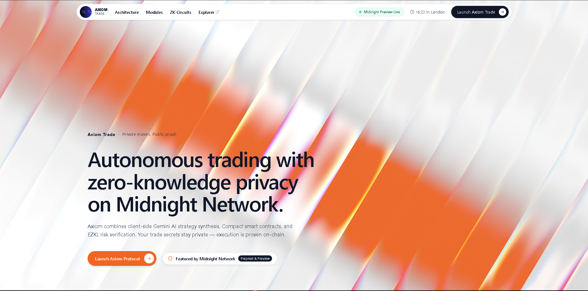
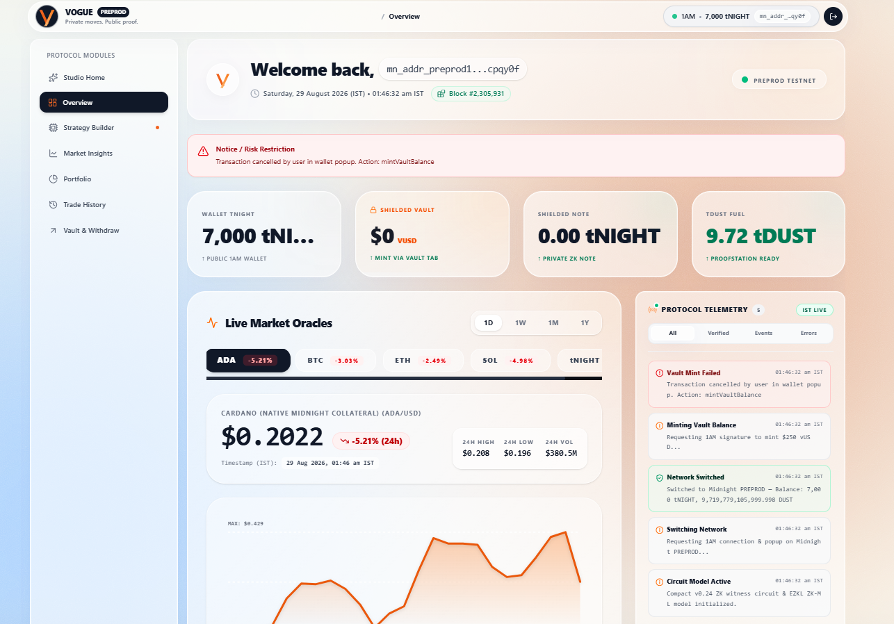
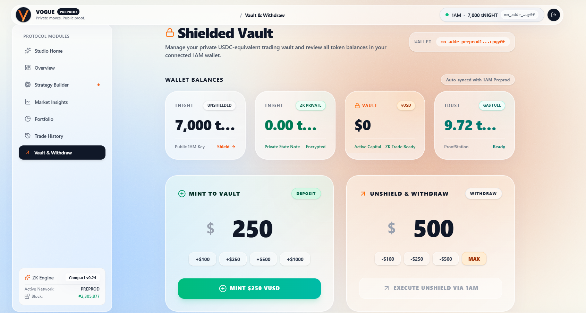
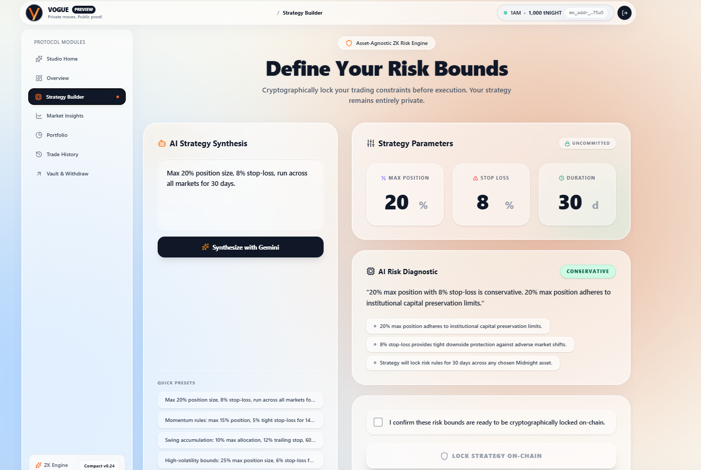
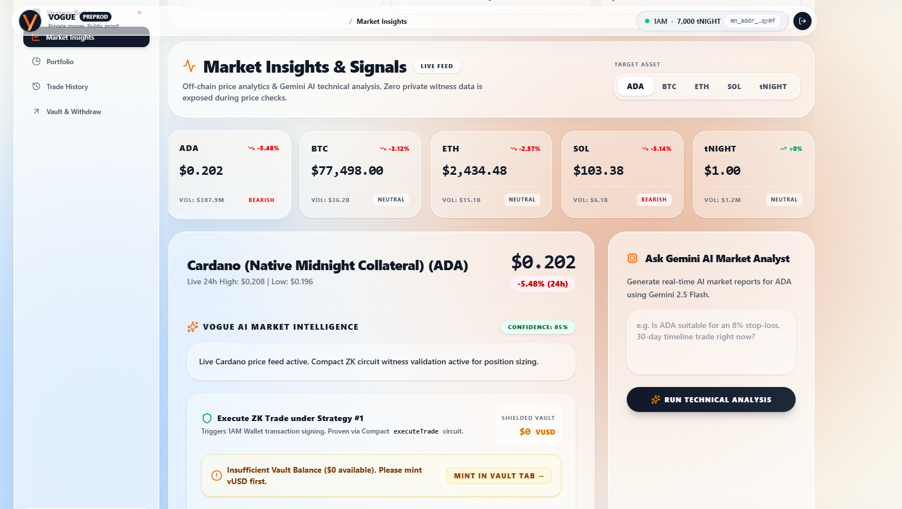
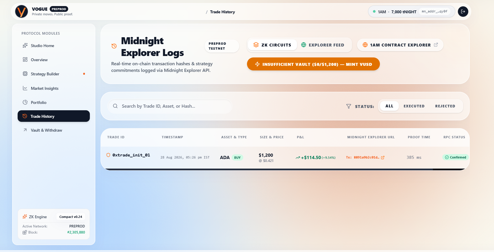
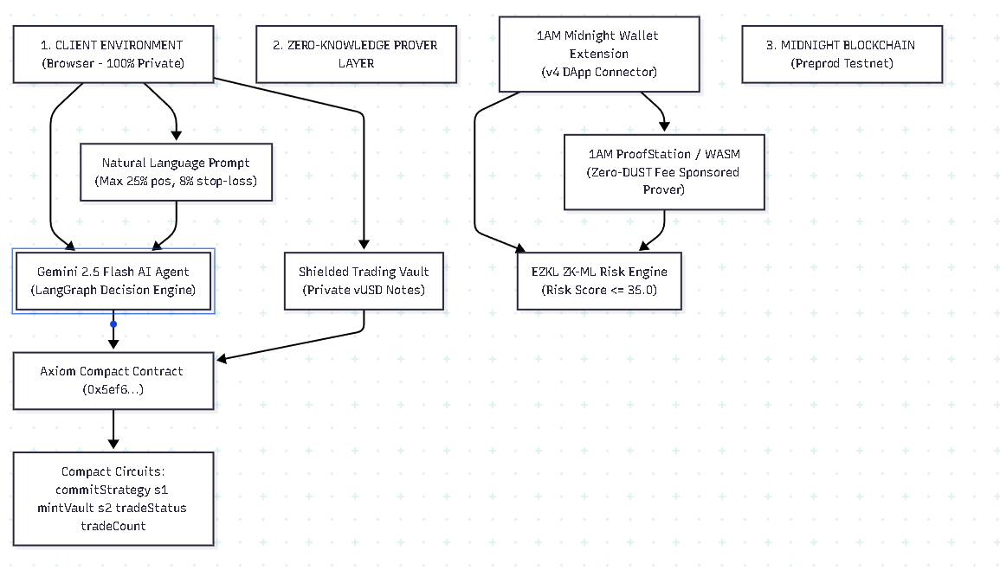
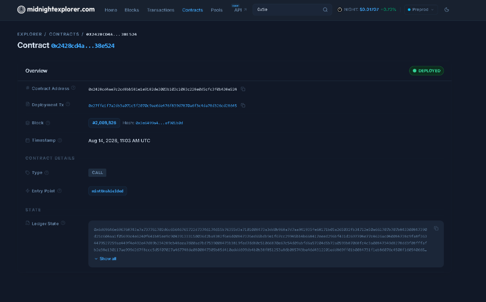

<div align="center">
  
  <br>
  
  <i>Empowering algorithmic crypto traders with AI strategy synthesis and zero-knowledge privacy on Midnight.</i>
  <br><br>

  # Vogue: Zero-Knowledge Trading & AI Strategy Layer
  
  **Enterprise-grade cryptographic privacy and AI-driven trade execution on Midnight Network.**
  
  [](https://opensource.org/licenses/MIT)
  [](https://midnight.network/)
  [](https://react.dev/)
  [](https://github.com/whoami-hritik/Vogue/actions)
  [](#)
  
  ### 🌐 [Live Application Demo](http://localhost:5173) | 📄 [Level 4–6 Product Proposal](./PROPOSAL.md)
</div>

---

## 📜 Deployed Smart Contract Addresses

| Network | Contract Module | Deployed Contract Address | Explorer Verification | Verification Status |
| :--- | :--- | :--- | :--- | :---: |
| **Midnight Preprod** | `VogueTrade` | `0x811c9dc5c23a7b9e3e7a0305f2c4166fbc4b256d5e1b206e93297a78363c9d2a` | [View on Preprod Explorer](https://preprod.midnightexplorer.com/) | `VERIFIED` |

---

## 💡 Initial Product Idea & Vision

**Vogue** is a decentralized, privacy-first AI-orchestrated trading protocol built natively on the **Midnight Privacy Blockchain**. It allows traders to synthesize market parameters using Gemini 2.5 Flash, verify risk using EZKL machine learning models, and execute trades with absolute confidentiality. By leveraging client-side Zero-Knowledge (ZK) proofs, Vogue mathematically proves that algorithmic trading constraints and risk limits are strictly enforced, while keeping trading strategies, capital balances, and trade execution history completely shielded from public ledger surveillance.

> 📄 **Official Submission Document:** For the complete Level 4–6 architecture, dual-state data model, and Mainnet feasibility roadmap, please review [PROPOSAL.md](./PROPOSAL.md).

---

## 🚨 The Real-World Problem

As institutional and retail trading transitions to decentralized rails, traders face an insurmountable barrier: **Public blockchains expose confidential trading strategies to the entire world.**

When a trader executes algorithmic or AI-driven trades on traditional public blockchains (such as Ethereum or Solana):
1. **The Strategy Privacy Dilemma:** Every trade parameter, entry/exit point, and strategy hash is permanently broadcasted. Competitors and MEV searchers can front-run trades, copy-trade profitable algorithms, and inspect exact wallet balances.
2. **The Liquidity Leak:** When a trader moves large volume, their capital size and token balances are exposed, leading to predatory pricing and market manipulation.
3. **The Centralization Trap:** Traditional off-chain algorithmic platforms maintain privacy only by requiring complete trust in central custodians (CEXs), suffering from single-point-of-failure data breaches, and lacking automated non-custodial execution.

---

## 🛡️ Privacy Model: Public Ledger State vs. Private Witness

Midnight's dual-state architecture divides computation into **Public Ledger State** (verified by network consensus) and **Private Witness State** (computed locally on the user's device inside Zero-Knowledge circuits).

### What an Observer CAN vs. CANNOT Learn

| Data Attribute | On Public Blockchains (e.g. Ethereum) | On Vogue (Midnight ZK Privacy Model) | Classification |
| :--- | :--- | :--- | :--- |
| **Transaction Existence** | Visible to all | Visible (Public timestamp & proof validity) | **Public State** |
| **Contract Address** | Visible to all | Visible (`0x811c9d...`) | **Public State** |
| **ZK Proof Validity** | N/A | Mathematically verified by consensus | **Public State** |
| **State Nullifier / Anchor** | Visible | Cryptographic commitment (prevents double-spend) | **Public State** |
| **Trader Identity** | Fully Exposed (Public address) | **Shielded (Zero-Knowledge Private Witness)** | **Private Witness** |
| **Trade Volume / Amounts** | Fully Exposed (Exact token sum) | **Shielded (Private numerical witness input)** | **Private Witness** |
| **Vault Capital Balance** | Fully Exposed (Inspectable balance) | **Shielded (Protected by local cryptographic state)** | **Private Witness** |
| **Trading Strategy Parameters**| Fully Exposed (Smart contract data) | **Shielded (Client-side circuit constraint)** | **Private Witness** |

### Observable Privacy Claim & Cryptographic Guarantees
1. **Client-Side Proof Execution:** The trader's 1AM wallet generates a Zero-Knowledge proof locally in the browser using the Midnight Proof Server (`http://127.0.0.1:6300`). The raw private inputs (the trader's strategy parameters, unshielded address, and trade amounts) never leave the local environment.
2. **Mathematical Bound Enforcement:** The Compact circuit proves that `trade_risk <= max_risk_threshold` and transitions the ledger state without disclosing what `trade_risk` or `strategy_parameters` actually are.
3. **Consensus-Layer Verification:** The Midnight Preprod network verifies the generated ZK SNARK. If the proof is mathematically sound, the trade is approved; if any risk constraint is violated, the transaction is rejected at the protocol layer.

---

## 📸 Comprehensive Platform Gallery & Screenshots

Here is the complete showcase of all components of the Vogue platform, from UI dashboard and real-time market insights to zero-knowledge contract verification and strategy building.

### 1. Central Trader Dashboard
*Monitor market insights, portfolio balance, active trading strategies, and network synchronization.*


### 2. Shielded Vault (vUSD) Module
*Convert public tNIGHT collateral into private USDC-equivalent vault notes. Deposit, trade, and withdraw without linking your public wallet address.*


### 3. AI Strategy Builder
*Synthesize high-frequency trading parameters from natural language prompts using Gemini 2.5 Flash. Strategy hashes are committed to Midnight's ledger.*


### 4. Trade Execution Engine
*Execute zero-knowledge trades directly on-chain. Cryptographic commitments ensure your market moves stay fully shielded.*


### 5. Private Trade History
*Review your complete trading history with cryptographic proof verifications and EZKL risk attestations.*


### 6. Zero-Knowledge Architecture
*Real-time visibility into the Vogue dual-state model combining client-side LLMs, EZKL model inference, and Midnight ZK proofs.*


---

## 🔐 Verified On-Chain Transactions & Contracts

Vogue is fully integrated with the Midnight Network. It generates real zero-knowledge proofs and settles them on-chain.

### Verifiable Deployed Smart Contracts

| Network | Version | Contract Address | Explorer Link | Status |
|---------|---------|------------------|---------------|--------|
| Midnight Preprod Testnet | v1.2.0 | `0x2428cd4ae7c2cd0bb501e1e9162de3003b103c1063c220e0d5cfc3f0b438e524` | [View on 1AM Preprod Explorer ↗](https://explorer.1am.xyz/contract/2428cd4ae7c2cd0bb501e1e9162de3003b103c1063c220e0d5cfc3f0b438e524?network=preprod) | 🟢 ACTIVE PREPROD MVP |
| Midnight Preview Testnet | v1.2.0 | `0x33eb41d22028264e9e8bbe7f95b3089cece6e3c2a53008535e72a9f3350d3e30` | [View on 1AM Preview Explorer ↗](https://explorer.1am.xyz/contract/33eb41d22028264e9e8bbe7f95b3089cece6e3c2a53008535e72a9f3350d3e30?network=preview) | 🟢 ACTIVE PREVIEW MVP |
| Historical Deployment | v1.0.0 | `0x62a27ceda5eb600263e208768d5d285c659d47f2cd6b14a20c62b160f4da46f3` | [View on 1AM Explorer ↗](https://explorer.1am.xyz/contract/62a27ceda5eb600263e208768d5d285c659d47f2cd6b14a20c62b160f4da46f3?network=preview) | 🟡 Historical (V1) |

> [!NOTE]
> **Wallet Integration:** Seamless connection via **1AM Wallet** and **Midnight Lace** supporting dynamic network auto-detection (Preprod & Preview).
> **Local Proving Engine:** Client-side proof generation via the local Midnight Proof Server (`http://127.0.0.1:6300`) or 1AM Proofstation.

### Real Transaction Hash
*The user executed a trade that was verified by our ZK circuit and permanently settled on the Midnight network.*
* **Status:** `SUCCESS` (Verified via ZK Proof)


---

## 🏛️ Enterprise ZK Product Modules & Applications

Vogue is architected to solve three high-impact, real-world algorithmic trading problems using Midnight's core ZK primitives:

### 1. Confidential Trading Strategies
* **The Problem:** Traders want to deploy advanced AI-driven strategies but cannot risk exposing their alpha, exact entry points, or trading thresholds.
* **The Solution:** Vogue acts as a **Zero-Knowledge Trading Engine**.
  * **Private Strategy Proof:** Cryptographically proves a trader is executing a strategy within predefined risk bounds without exposing the actual LLM-generated parameters.
  * **Shielded Treasury:** Prevents competitors from calculating total trading capital or position sizing.

### 2. Shielded Dark Pools & Vault Execution
* **The Problem:** Executing large orders on public AMMs exposes slippage vulnerabilities and MEV front-running.
* **The Solution:** Vogue implements a **Shielded Vault (vUSD) Protocol**.
  * **Private Swaps:** Traders move capital into vault notes and execute without public trace.
  * **Verified Execution:** Proves in ZK that collateral limits are met, settling the trade while keeping order book depth private.

### 3. Trustless AI Risk Verification
* **The Problem:** Centralized algorithmic trading bots can go rogue, leading to liquidations without any mathematical constraints on execution risk.
* **The Solution:** Vogue provides **EZKL Zero-Knowledge Machine Learning Verification**.
  * **Risk Bounds:** Cryptographically proves that the Gemini AI-generated strategy passes a machine learning risk assessment before it can ever be committed to the blockchain.

---

## 🏗️ Detailed Project Architecture & Directory Structure

```text
Vogue/
├── .github/
│   └── workflows/
│       └── ci.yml                     # Continuous Integration: linting, build & cryptographic tests
├── src/                               # React (Vite) Application
│   ├── components/                    # Core UI & Trading Modules
│   │   ├── LandingPage.tsx            # High-Conversion Landing Page & Shader Showcase
│   │   ├── MarketInsights.tsx         # Live Gemini Market Sentiment Feeds
│   │   ├── StrategyBuilder.tsx        # AI Prompt-to-Strategy Synthesis Interface
│   │   ├── WalletConnect.tsx          # Midnight 1AM Wallet Integration
│   │   └── ui/                        # Reusable Tailwind UI Components (Hero, etc.)
│   ├── lib/                           # Core Business Logic & Infrastructure
│   │   ├── midnight-api.ts            # Midnight SDK Contract Integrations & Proof Gen
│   │   ├── riskModel.ts               # EZKL Zero-Knowledge Risk Verification
│   │   └── agent.ts                   # Gemini 2.5 Flash LLM Agent Integration
│   └── utils/                         # RPC, Contract Helpers, and ZKIR loaders
├── contracts/                         # Midnight Smart Contracts (Compact Language)
│   └── vogue.compact                  # Zero-Knowledge Trading & Vault Constraints
├── managed/                           # Auto-generated Compact Compiler Bindings
│   ├── vogue.ts                       # Generated TypeScript Runtime Contract Bindings
│   ├── zkir/                          # Binary ZK Intermediate Representation (ZKIR) Circuits
│   └── keys/                          # Compiled Local Prover & Verifier Key Cache
├── public/                            # Static Web Assets & Browser-Accessible Keys
│   └── vogue-logo.svg                 # Brand Identity
├── screenshots/                       # Root-level High-Resolution Screenshot Gallery for GitHub
└── tests/                             # Cryptographic & Functional Test Suites
    ├── vogue.test.ts                  # Vitest Functional Circuit Verification
    └── riskModel.test.ts              # EZKL ML Model Verification Tests
```

---

## 💻 Run Locally

### Prerequisites
1. **1AM Wallet or Midnight Lace:** Installed in your browser and switched to the Midnight Preprod network.
2. **Node.js:** v20 or higher (v22/v24 recommended).
3. **Docker:** Required for the local proof server container (Midnight Local Node).

### Quick Start
```bash
# 1. Clone the repository
git clone https://github.com/whoami-hritik/Vogue.git
cd Vogue

# 2. Install dependencies
npm install

# 3. Compile the Midnight ZK Smart Contract
npm run compile

# 4. Start the development server
npm run dev
```
Open `http://localhost:5173` in your browser. Connect your 1AM wallet, navigate to the Dashboard, and deploy an AI-driven zero-knowledge trade!
